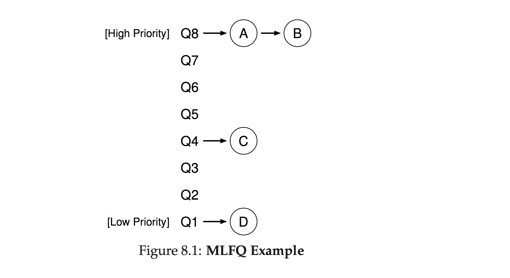

# Multi-Level-Feedback-Queue

### Motivation
After talking about one of the most popular scheduling algorithms used by operating systems to schedule processes,
let's implement it! This will be an implementation that simulates an actual multi-level feedback queue processing
blocking and non-blocking processes with multiple priority levels.

### Reiterating on How Scheduling Works
One of the main jobs of operating system kernels is that they need to be able to execute all of the processes 
running on your computer efficiently such that high priority processes are completed as quickly as possible,
while also ensuring that there is some fairness in how they schedule processes; even if a process is a low 
priority, it eventually needs to be complete execution.

In order to achieve this, schedulers essentially iterate through all of the processes on your computer, grab
the highest priority process and execute it for a time quantum. Once the time quantum is up, the process has
either completed or it hasn't. If it hasn't, then the process is shunted to the next lower priority queue to
wait until it is its turn again. If the process completed during the initial time quantum, then it gets 
discarded and the scheduler moves on to the next process in line. 

One thing to note is that processes in higher priority queues are allocated less CPU time than processes in a 
lower priority queue. The logic here is that the scheduler wants to get through as many of the short, high 
priority processes first, then the long, high priority processes, followed by the short low priority processes,
before finally getting around to the long, low priority processes. Oftentimes, these long-running low priority 
processes only get allocated CPU time when your computer is idle, since otherwise, new processes are constantly 
being added to the scheduling queue. 

### Architecture


### Algorithm
The pseudo code for our MLFQ implementation is as follows:
```
Loop:
    If a process exists in the blocking queue:
        Work on removing each process in the blocking queue on a First Come First Serve basis
        When a process is removed from the blocking queue, add it back to the highest priority level CPU queue

    Iterate from the top priority CPU queue to the lowest priority CPU queue until we find a process
    If a process is found:
        Work on that process until the end of the queue's specified time quantum
            Do non-blocking work (since we're in the non-blocking CPU queues)
            If the process becomes blocking:
                Remove it from the CPU queue
                Place it on the blocking queue
                Restart the time quantum with the next process in the CPU queue

        If the end of the time quantum has been reached:
            Remove the process that is currently being worked on from the top of the CPU queue
            If the process is not finished:
                If the process is already in the lowest priority queue:
                    Add it to the back of the same queue
                Else:
                    Add the process to the back of the next lower priority queue
```

### Further Reading
Here's a chapter from an operating systems textbook that dives a lot deeper into the theory and motivation behind 
the multi-level feedback queue:
[http://pages.cs.wisc.edu/~remzi/OSTEP/cpu-sched-mlfq.pdf](http://pages.cs.wisc.edu/~remzi/OSTEP/cpu-sched-mlfq.pdf)

